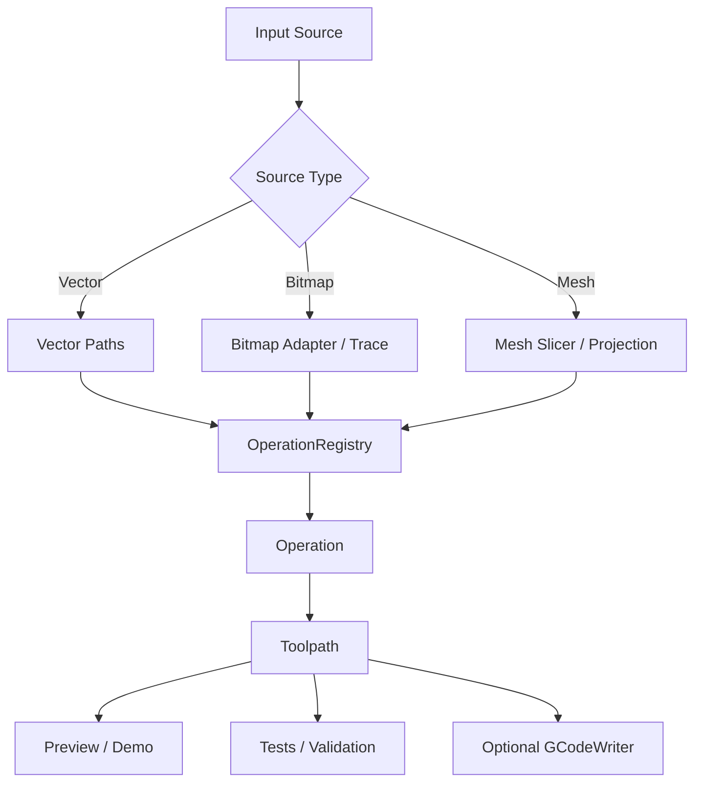

# CAM Engine

Universal toolpath engine for vector, bitmap, and mesh CAM.

Focus: toolpath creation only.

No machine profiles.

No post/gcode abstraction in the core API.

## Scope

- Vector CAM.
- Bitmap CAM.
- 3D mesh CAM.
- Browser demo with 2D and 3D preview.
- Node-compatible tests.

## Current Operations

### Vector

- `vector-cut`
- `vector-inside`
- `vector-outside`
- `vector-pocket`
- `vector-pocket-raster`
- `vector-raster-fill`
- `vector-crosshatch`
- `vector-concentric`
- `vector-stepdown`
- `vector-vcarve`

### Laser

- `laser-vector`
- `laser-inside`
- `laser-outside`
- `laser-fill`
- `laser-crosshatch`
- `laser-concentric`

### Bitmap

- `bitmap-raster`
- `bitmap-trace`
- `bitmap-halftone`
- `bitmap-wavy`
- `bitmap-heightmap`
- `bitmap-trace-cut`
- `bitmap-trace-inside`
- `bitmap-trace-outside`
- `bitmap-trace-pocket`
- `bitmap-trace-pocket-raster`
- `bitmap-trace-raster-fill`
- `bitmap-trace-crosshatch`
- `bitmap-trace-vcarve`
- `bitmap-trace-stepdown`

### Mesh

- `mesh-waterline-roughing`
- `mesh-raster-roughing`
- `mesh-raster-finishing`
- `mesh-profile`

`mesh-profile` projects the mesh silhouette to XY, then runs 2D profiling or pocket-style stepdown logic.

## Architecture



## API

## Main Exports

- `UniversalEngine`
- `OperationRegistry`
- `Engine`
- `Path`
- `Toolpath`
- `OperationConfig`
- `GCodeWriter`

Mesh-specific operations are exported directly too.

See [index.js](./index.js).

## Recommended Entry Point

Use `UniversalEngine` for normalized toolpath jobs.

```js
import { UniversalEngine } from './index.js';

const engine = new UniversalEngine();

const job = engine.createToolpath({
  source: {
    type: 'vector',
    paths: [
      {
        closed: true,
        points: [
          { x: 0, y: 0, z: 0 },
          { x: 40, y: 0, z: 0 },
          { x: 40, y: 40, z: 0 },
          { x: 0, y: 40, z: 0 }
        ]
      }
    ]
  },
  operationId: 'vector-stepdown',
  config: {
    mode: 'outside',
    toolDiameter: 3.175,
    cutWidth: 3.175,
    zStart: 0,
    zEnd: -6,
    passDepth: 1.5,
    finishPassDepth: 0.25,
    springPasses: 1,
    tabs: [{ x: 20, y: 0, width: 4, height: 1 }]
  }
});

console.log(job.result.toJSON());
```

## Capability Discovery

```js
import { UniversalEngine } from './index.js';

const engine = new UniversalEngine();

console.log(engine.describeCapabilities());
console.log(engine.listOperations({ sourceType: 'mesh' }));
console.log(engine.getDefaultConfig('mesh-profile'));
```

## Toolpath Shape

`Toolpath` contains:

- `operationType`
- `config`
- `paths`
- `zLevels`
- `bounds`
- `metadata`
- `totalCutDistance`

Each `Path` contains:

- `points`
- `closed`

Each point is `{ x, y, z }`.

## Tabs API

Tabs are coordinate-driven.

Pass an array of coordinates in stepdown-style operations.

```js
{
  tabs: [
    { x: 10, y: 0, width: 4, height: 1 },
    { x: 30, y: 0, width: 4, height: 1 }
  ],
  tabWidth: 4,
  tabHeight: 1,
  tabTolerance: 0.75
}
```

When a path segment passes near a tab coordinate, Z is raised across that tab span.

## Demo

Demo entry:

- [demo/index.html](./demo/index.html)

Open it through a local HTTP server.

Do not open it as `file://`.

The demo now loads browser-only dependencies from CDN:

- `js-clipper`
- `three`
- `OrbitControls`

Current demo coverage:

- Vector cut
- Inside/outside offset
- Layered stepdown
- Pocket
- Raster fill
- Laser cut/fill
- V-carve
- 2D preview
- 3D preview of toolpaths

Current demo limitation:

- G-code export in the demo is only wired for flat cam-path output.
- Variable-Z mesh and stepdown preview works, but full 3D toolpath export UI is not finished.

## Validation

Run tests:

```bash
npm test
```

Current validation style:

- Node unit tests
- Toolpath bounds checks
- Z-level checks
- Expected path count / geometry checks
- Mesh roughing, finishing, and projected profile tests

## Status

Core engine coverage is in place for the requested operation families.

Remaining likely expansion areas:

- More bitmap artistic fills.
- Better texture operation normalization.
- Dedicated drag-knife and pen-plotter planners.
- Browser UI for mesh input loading.
